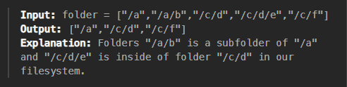

* Trick is to use find last '/' which give us idea about the file

 we can see **/a** is parent and **/a/b** is sub-directory
 lets take example
 /a/b/c/d and /a/b/c in this case /a/b/c is parent so we remove first

algorithm is exact the same 