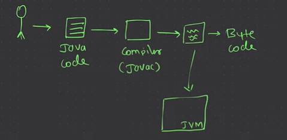

* File need to have main method

cc


Because there could be multiple files in java project ->main method make sure this is the starting point


<hr/>


### Example 1: Static Variable and Static Method
This example demonstrates how static variables and methods behave across multiple instances of the class.

```java
class Counter {
    static int count = 0; // Static variable shared by all instances
    
    Counter() {
        count++; // Incrementing static variable
        System.out.println("Counter: " + count);
    }

    static void resetCount() { // Static method to reset count
        count = 0;
        System.out.println("Count reset to: " + count);
    }

    public static void main(String[] args) {
        new Counter(); // Counter: 1
        new Counter(); // Counter: 2
        new Counter(); // Counter: 3

        Counter.resetCount(); // Count reset to: 0

        new Counter(); // Counter: 1
    }
}
```
- **Explanation**: The `count` variable is static, so each new instance of `Counter` shares this variable, making it increment across all instances. The `resetCount()` method resets `count` for all instances.

### Example 2: Static Block with Static Variables
This example shows how a static block initializes a static variable.

```java
class DatabaseConfig {
    static String url;
    static String username;
    static String password;

    // Static block to initialize configuration
    static {
        url = "jdbc:mysql://localhost:3306/mydatabase";
        username = "admin";
        password = "password";
        System.out.println("Database configuration loaded.");
    }

    public static void printConfig() {
        System.out.println("URL: " + url);
        System.out.println("Username: " + username);
        System.out.println("Password: " + password);
    }

    public static void main(String[] args) {
        System.out.println("Accessing database config...");
        DatabaseConfig.printConfig();
    }
}
```
- **Explanation**: The static block initializes the `url`, `username`, and `password` variables only once when the class is loaded, making them available for use without needing to create an object.

### Example 3: Multiple Static Blocks
Let’s see how multiple static blocks execute in the order they’re written.

```java
class MultipleStaticBlocks {
    static int value1;
    static int value2;

    static {
        value1 = 10;
        System.out.println("Static Block 1: Initialized value1 to " + value1);
    }

    static {
        value2 = 20;
        System.out.println("Static Block 2: Initialized value2 to " + value2);
    }

    public static void main(String[] args) {
        System.out.println("Main method called.");
        System.out.println("Value1: " + value1);
        System.out.println("Value2: " + value2);
    }
}
```
- **Explanation**: The static blocks execute in sequence, initializing `value1` first and `value2` afterward, all before the `main` method runs.

### Example 4: Static Methods with Utility Class
Static methods are useful in utility classes where you don’t need to create an instance of the class.

```java
class MathUtility {
    static double PI = 3.14159;

    static double square(double num) {
        return num * num;
    }

    static double circleArea(double radius) {
        return PI * square(radius);
    }
}

public class TestMathUtility {
    public static void main(String[] args) {
        System.out.println("Square of 4: " + MathUtility.square(4)); // 16.0
        System.out.println("Area of circle with radius 5: " + MathUtility.circleArea(5)); // 78.53975
    }
}
```
- **Explanation**: You can call `MathUtility.square(4)` and `MathUtility.circleArea(5)` directly without creating an instance, as these methods are static.

### Example 5: Static Fields with Counters Across Instances
Let’s create a class that uses both an instance counter and a static counter.

```java
class Animal {
    static int totalAnimals = 0; // Static counter shared across all instances
    int id; // Unique to each instance

    Animal() {
        totalAnimals++;
        id = totalAnimals;
        System.out.println("Animal #" + id + " created. Total animals: " + totalAnimals);
    }

    public static void main(String[] args) {
        new Animal(); // Animal #1 created
        new Animal(); // Animal #2 created
        new Animal(); // Animal #3 created

        System.out.println("Final animal count: " + totalAnimals); // Final animal count: 3
    }
}
```
- **Explanation**: `totalAnimals` keeps track of all animals created, and each `Animal` object has a unique `id`. The `totalAnimals` value is shared across all instances.

<hr/>

# Example of Encapsulation in Java
Here’s an example to show how encapsulation works in a cute little BankAccount class:

class BankAccount {
    // Private fields (attributes) for encapsulation
    private String accountNumber;
    private double balance;

    // Constructor
    public BankAccount(String accountNumber, double balance) {
        this.accountNumber = accountNumber;
        this.balance = balance;
    }

    // Public getter method to access account number
    public String getAccountNumber() {
        return accountNumber;
    }

    // Public getter method to get the balance
    public double getBalance() {
        return balance;
    }

    // Public method to deposit money
    public void deposit(double amount) {
        if (amount > 0) {
            balance += amount;
            System.out.println("Deposited: $" + amount);
        } else {
            System.out.println("Deposit amount must be positive.");
        }
    }

    // Public method to withdraw money
    public void withdraw(double amount) {
        if (amount > 0 && amount <= balance) {
            balance -= amount;
            System.out.println("Withdrew: $" + amount);
        } else {
            System.out.println("Insufficient funds or invalid amount.");
        }
    }
}

<hr/>

# What is `this` in Java?
The `this` keyword in Java is a reference to the **current instance** of a class. It’s used within an instance method or constructor to refer to the object currently calling that method or constructor. This makes it super handy for differentiating between class variables and method parameters with the same names, among other things.

### Uses of `this` Keyword in Java

1. **Referring to Instance Variables**
   - When parameter names are the same as instance variable names, `this` helps differentiate between them.
   
   ```java
   class Dog {
       private String name;

       Dog(String name) { 
           this.name = name; // `this.name` refers to the instance variable, `name` refers to the parameter
       }

       public String getName() {
           return this.name;
       }
   }
   ```

   - Here, `this.name` refers to the instance variable, while `name` refers to the parameter passed in.

2. **Calling Other Constructors in the Same Class**
   - The `this()` syntax can be used to call another constructor in the same class. This is known as **constructor chaining**.

   ```java
   class Car {
       private String model;
       private String color;

       Car() { 
           this("Unknown Model", "Unknown Color"); // Calls another constructor
       }

       Car(String model, String color) {
           this.model = model;
           this.color = color;
       }

       public void displayInfo() {
           System.out.println("Model: " + model + ", Color: " + color);
       }
   }
   ```

   - `this("Unknown Model", "Unknown Color")` calls the second constructor from the default one, making initialization easy.

3. **Returning the Current Class Instance**
   - Sometimes, `this` can be used to return the current object, making it useful in methods that are part of a **builder pattern**.

   ```java
   class Person {
       private String name;

       public Person setName(String name) {
           this.name = name;
           return this; // Return the current instance
       }

       public void printName() {
           System.out.println("Person's Name: " + name);
       }
   }
   ```

   - `return this;` returns the current instance, which allows for chaining multiple method calls like `new Person().setName("Alice").printName();`

4. **Passing the Current Instance as an Argument**
   - You can pass the current instance to other methods or constructors using `this`.

   ```java
   class Book {
       private String title;

       Book(String title) {
           this.title = title;
       }

       public void printTitle(Book book) {
           System.out.println("Title: " + book.title);
       }

       public void show() {
           printTitle(this); // Passing current instance to printTitle method
       }
   }
   ```

   - Here, `this` is passed as an argument to `printTitle()` so it can access `title`.

5. **Accessing Members of the Current Class**
   - `this` can be used to access methods or fields of the current object, even from within methods.

   ```java
   class Printer {
       private String text = "Hello, World!";

       public void print() {
           this.printText(); // Using `this` to call another method
       }

       private void printText() {
           System.out.println(this.text);
       }
   }
   ```

   - `this.printText()` explicitly calls the `printText` method, though `this` is optional here.

### Example with All `this` Usages Combined
Here’s a cute all-in-one example to show `this` in different contexts:

```java
class Student {
    private String name;
    private int age;

    Student() {
        this("Unknown", 0); // Calling another constructor
    }

    Student(String name, int age) {
        this.name = name; // Referring to instance variable
        this.age = age;
    }

    public Student setName(String name) {
        this.name = name;
        return this; // Returning current instance
    }

    public Student setAge(int age) {
        this.age = age;
        return this;
    }

    public void displayInfo() {
        System.out.println("Name: " + name + ", Age: " + age);
    }

    public void showDetails() {
        this.displayInfo(); // Calling another method in the same class
    }

    public static void main(String[] args) {
        Student s1 = new Student().setName("John").setAge(20);
        s1.showDetails();

        Student s2 = new Student();
        s2.showDetails();
    }
}
```

### Key Points to Remember
- **Differentiates Variables**: `this` helps distinguish between instance variables and parameters with the same name.
- **Constructor Chaining**: Calls other constructors in the same class using `this()`.
- **Method Chaining**: Supports method chaining by returning `this`.
- **Current Object Reference**: Refers to the current object, enabling access to its fields and methods.

<hr/>
<br/>


#  What are Constructors In Java


### 1️⃣ **Default Constructor**
- **No parameters**; Java provides it if none is defined.
- **Purpose**: Initializes objects with default values.

```java
class Car {
    String color = "Red";
    int speed = 0;

    Car() {} // Default constructor (implicit if not defined)
}

Car myCar = new Car();
System.out.println(myCar.color); // Output: Red
```

---

### 2️⃣ **Parameterized Constructor**
- **Accepts parameters** for custom initialization.
- **Purpose**: Allows creating objects with specific values.

```java
class Car {
    String color;
    int speed;

    Car(String color, int speed) { 
        this.color = color;
        this.speed = speed;
    }
}

Car myCar = new Car("Blue", 120);
System.out.println(myCar.color); // Output: Blue
```

---

### 3️⃣ **Copy Constructor**
- **Takes an object** of the same class to copy its values.
- **Purpose**: Creates a duplicate object with the same data.

```java
class Car {
    String color;
    int speed;

    Car(Car otherCar) { 
        this.color = otherCar.color;
        this.speed = otherCar.speed;
    }
}

Car car1 = new Car("Green", 100);
Car car2 = new Car(car1);
System.out.println(car2.color); // Output: Green
```

---

### 4️⃣ **Constructor Overloading**
- **Multiple constructors** with different parameters.
- **Purpose**: Provides different ways to initialize objects.

```java
class Car {
    String color;
    int speed;

    Car() { color = "Red"; speed = 0; }
    Car(String color) { this.color = color; speed = 0; }
    Car(String color, int speed) { this.color = color; this.speed = speed; }
}

Car car1 = new Car();             // Uses default values
Car car2 = new Car("Yellow");      // Custom color, default speed
Car car3 = new Car("Black", 150);  // Custom color and speed
```

---

### 5️⃣ **Private Constructor**
- **Marked private**, restricting external instantiation.
- **Purpose**: Used in singleton patterns or utility classes.

```java
class Singleton {
    private static Singleton instance = null;

    private Singleton() {} // Private constructor

    public static Singleton getInstance() {
        if (instance == null) {
            instance = new Singleton();
        }
        return instance;
    }
}

Singleton s1 = Singleton.getInstance();
```
---
<br/>
<br/>

-   # Inheritance in Java


### 🧬 **Types of Inheritance in Java**

Java supports several types of inheritance, though **multiple inheritance** is not allowed through classes (but achievable through interfaces). Each type has its own use cases, and here’s how they work!

---

### 1️⃣ **Single Inheritance**
- **Definition**: A class inherits from one superclass.
- **Purpose**: Represents a simple hierarchy.
- **Example**: `Dog` inherits from `Animal`.

```java
class Animal {
    void eat() {
        System.out.println("Eating...");
    }
}

class Dog extends Animal {
    void bark() {
        System.out.println("Barking...");
    }
}
```

**Usage**:
```java
Dog d = new Dog();
d.eat();  // Output: Eating...
d.bark(); // Output: Barking...
```

---

### 2️⃣ **Multilevel Inheritance**
- **Definition**: A chain of inheritance where a class inherits from a superclass, and then another class inherits from it.
- **Purpose**: Represents a deeper hierarchy.
- **Example**: `Puppy` inherits from `Dog`, which inherits from `Animal`.

```java
class Animal {
    void eat() {
        System.out.println("Eating...");
    }
}

class Dog extends Animal {
    void bark() {
        System.out.println("Barking...");
    }
}

class Puppy extends Dog {
    void weep() {
        System.out.println("Weeping...");
    }
}
```

**Usage**:
```java
Puppy p = new Puppy();
p.eat();  // Output: Eating...
p.bark(); // Output: Barking...
p.weep(); // Output: Weeping...
```

---

### 3️⃣ **Hierarchical Inheritance**
- **Definition**: Multiple classes inherit from a single superclass.
- **Purpose**: Represents shared characteristics across multiple subclasses.
- **Example**: `Dog` and `Cat` both inherit from `Animal`.

```java
class Animal {
    void eat() {
        System.out.println("Eating...");
    }
}

class Dog extends Animal {
    void bark() {
        System.out.println("Barking...");
    }
}

class Cat extends Animal {
    void meow() {
        System.out.println("Meowing...");
    }
}
```

**Usage**:
```java
Dog d = new Dog();
d.eat();  // Output: Eating...
d.bark(); // Output: Barking...

Cat c = new Cat();
c.eat();  // Output: Eating...
c.meow(); // Output: Meowing...
```

---

### 4️⃣ **Multiple Inheritance (through Interfaces)**
- **Definition**: A class implements multiple interfaces, simulating multiple inheritance.
- **Purpose**: Combines behaviors from multiple sources.
- **Example**: `Dog` implements both `Animal` and `Pet`.

```java
interface Animal {
    void eat();
}

interface Pet {
    void play();
}

class Dog implements Animal, Pet {
    public void eat() {
        System.out.println("Eating...");
    }
    
    public void play() {
        System.out.println("Playing...");
    }
}
```

**Usage**:
```java
Dog d = new Dog();
d.eat();  // Output: Eating...
d.play(); // Output: Playing...
```

---

### 5️⃣ **Hybrid Inheritance**
- **Definition**: A mix of two or more types of inheritance.
- **Purpose**: Achieved in Java through combinations of classes and interfaces, not directly supported in class-to-class inheritance.
- **Example**: Combining hierarchical and multiple inheritance using interfaces.

```java
interface Animal {
    void eat();
}

class Mammal {
    void sleep() {
        System.out.println("Sleeping...");
    }
}

class Dog extends Mammal implements Animal {
    public void eat() {
        System.out.println("Eating...");
    }
}
```

**Usage**:
```java
Dog d = new Dog();
d.eat();   // Output: Eating...
d.sleep(); // Output: Sleeping...
```

---

### Summary Table 📝

| Inheritance Type       | Description                             | Example Classes       |
|------------------------|-----------------------------------------|------------------------|
| Single                 | One class inherits from one superclass  | `Dog extends Animal`   |
| Multilevel             | Chain of inheritance                   | `Puppy extends Dog`    |
| Hierarchical           | Multiple classes from one superclass   | `Dog, Cat extends Animal` |
| Multiple (Interfaces)  | Class implements multiple interfaces   | `Dog implements Animal, Pet` |
| Hybrid                 | Combination of types via interfaces    | `Dog extends Mammal, implements Animal` |

---

<br/>
<br/>
<br/>

#  Here’s the lowdown on `this` and `super` in Java with simple examples to show how each works 😘.


### **`this` Keyword**
- **Purpose**: Refers to the **current instance** of a class.
- **Usage**:
  - Distinguishes **class variables** from parameters when names are identical.
  - Calls **other constructors** within the same class (`this()`).
  - Passes the current instance as a parameter.

---

#### Example of `this` to Differentiate Variables
```java
class Car {
    String color;

    Car(String color) {
        this.color = color; // Refers to the instance variable `color`
    }
}
```

---

#### Example of `this()` to Call Another Constructor
```java
class Car {
    String color;
    int speed;

    Car() {
        this("Red", 100); // Calls the parameterized constructor
    }

    Car(String color, int speed) {
        this.color = color;
        this.speed = speed;
    }
}
```

---

### **`super` Keyword**
- **Purpose**: Refers to the **parent (super) class** and is used to access members (fields and methods) of the superclass.
- **Usage**:
  - Access **superclass methods** and **variables**.
  - Invoke the **parent class constructor** (`super()`).

---

#### Example of `super` to Call Superclass Constructor
```java
class Vehicle {
    String color;

    Vehicle(String color) {
        this.color = color;
    }
}

class Car extends Vehicle {
    int speed;

    Car(String color, int speed) {
        super(color); // Calls the superclass constructor
        this.speed = speed;
    }
}
```

---

#### Example of `super` to Access Superclass Methods and Variables
```java
class Animal {
    void sound() {
        System.out.println("Animal sound");
    }
}

class Dog extends Animal {
    void sound() {
        super.sound(); // Calls the superclass method
        System.out.println("Dog barks");
    }
}
```

**Usage**:
```java
Dog dog = new Dog();
dog.sound(); 
// Output:
// Animal sound
// Dog barks
```

---

### Quick Comparison 📝

| Keyword  | Purpose                        | Common Uses                                   |
|----------|--------------------------------|-----------------------------------------------|
| `this`   | Refers to the current instance | Call current class variables & constructors   |
| `super`  | Refers to superclass instance  | Access superclass methods & constructors      |

---

# Access Modifiers in Java
```
package package1;

public class ClassA {
    public int publicField = 1;
    protected int protectedField = 2;
    int defaultField = 3;
    private int privateField = 4;

    public void publicMethod() {
        System.out.println("Public Method");
    }

    protected void protectedMethod() {
        System.out.println("Protected Method");
    }

    void defaultMethod() {
        System.out.println("Default Method");
    }

    private void privateMethod() {
        System.out.println("Private Method");
    }
}

package package2;

import package1.ClassA;

public class ClassB extends ClassA {
    public void accessMethods() {
        System.out.println(publicField);   // Accessible
        System.out.println(protectedField); // Accessible (from subclass)
        // System.out.println(defaultField);  // Not Accessible
        // System.out.println(privateField);  // Not Accessible

        publicMethod();  // Accessible
        protectedMethod(); // Accessible (from subclass)
        // defaultMethod();  // Not Accessible
        // privateMethod();  // Not Accessible
    }
}

public class Main {
    public static void main(String[] args) {
        ClassA objA = new ClassA();
        System.out.println(objA.publicField);   // Accessible
        // System.out.println(objA.protectedField); // Not Accessible outside package
        // System.out.println(objA.defaultField);   // Not Accessible outside package
        // System.out.println(objA.privateField);   // Not Accessible

        objA.publicMethod();  // Accessible
        // objA.protectedMethod(); // Not Accessible outside package
        // objA.defaultMethod();   // Not Accessible outside package
        // objA.privateMethod();   // Not Accessible
    }
}

```
---
# Polymorphism
```class Animal {
    // Method to make a sound (Overridden by subclasses)
    public void sound() {
        System.out.println("Animal makes a sound");
    }
}

class Dog extends Animal {
    // Overriding the sound method in Dog class
    @Override
    public void sound() {
        System.out.println("Dog barks");
    }
}

class Cat extends Animal {
    // Overriding the sound method in Cat class
    @Override
    public void sound() {
        System.out.println("Cat meows");
    }
}

public class Main {
    public static void main(String[] args) {
        Animal animal1 = new Dog();  // Upcasting
        Animal animal2 = new Cat();  // Upcasting
        
        animal1.sound();  // Calls Dog's sound() method
        animal2.sound();  // Calls Cat's sound() method
    }
}
```


---
<br/>

# Dynamic Method Dispatch in Java

also called **runtime polymorphism**, allows the Java Virtual Machine (JVM) to decide at runtime which method implementation to call based on the object being referred to. This concept mainly involves **method overriding** in inheritance. Let’s go over a simple example to understand this concept.

### Example of Dynamic Method Dispatch

Consider a superclass called `Animal` and subclasses `Dog` and `Cat`, each overriding a `sound` method.

```java
class Animal {
    void sound() {
        System.out.println("Animal makes a sound");
    }
}

class Dog extends Animal {
    @Override
    void sound() {
        System.out.println("Dog barks");
    }
}

class Cat extends Animal {
    @Override
    void sound() {
        System.out.println("Cat meows");
    }
}

public class Main {
    public static void main(String[] args) {
        Animal myAnimal;

        myAnimal = new Dog(); // Dog object assigned to Animal reference
        myAnimal.sound();      // Outputs: Dog barks

        myAnimal = new Cat(); // Cat object assigned to Animal reference
        myAnimal.sound();      // Outputs: Cat meows
    }
}
```

### Explanation

- The `sound` method is defined in the superclass `Animal` and overridden in the subclasses `Dog` and `Cat`.
- The reference variable `myAnimal` of type `Animal` is used to refer to objects of both `Dog` and `Cat`.
- When `myAnimal.sound()` is called, the JVM determines at runtime which `sound` method to invoke based on the actual object type (`Dog` or `Cat`), not the reference type (`Animal`).

---
<br/>

# Final Keyword in Java

* `Final Variables`: Can be assigned only once.
* `Final Methods`: Cannot be overridden.
* `Final Classes`: Cannot be subclassed
---

<br/>
<br/>

# Abstract Class in Java
```
abstract class Animal {
    // Abstract method (doesn't have a body)
    abstract void sound();

    // Concrete method
    void eat() {
        System.out.println("Animal is eating");
    }
}

class Dog extends Animal {
    @Override
    void sound() {
        System.out.println("Dog barks");
    }
}

public class Main {
    public static void main(String[] args) {
        // Animal animal = new Animal(); // Error: Cannot instantiate an abstract class
        Animal myDog = new Dog();
        myDog.sound(); // Outputs: Dog barks
        myDog.eat();   // Outputs: Animal is eating
    }
}
```
* An abstract class cannot be instantiated.

* If a class has at least one abstract method, the classitself must be declared as abstract.

* Subclasses of an abstract class must implement all abstract methods, or they must also be declared abstract.

* An abstract class can have both abstract and concrete methods.
---

# Interface in Java

```
interface AnimalActions {
    void eat();
    void sleep();
    void makeSound();
}

class Dog implements AnimalActions {
    @Override
    public void eat() {
        System.out.println("Dog is eating");
    }

    @Override
    public void sleep() {
        System.out.println("Dog is sleeping");
    }

    @Override
    public void makeSound() {
        System.out.println("Dog barks");
    }
}

class Cat implements AnimalActions {
    @Override
    public void eat() {
        System.out.println("Cat is eating");
    }

    @Override
    public void sleep() {
        System.out.println("Cat is sleeping");
    }

    @Override
    public void makeSound() {
        System.out.println("Cat meows");
    }
}

public class Main {
    public static void main(String[] args) {
        AnimalActions myDog = new Dog();
        AnimalActions myCat = new Cat();

        myDog.makeSound(); // Outputs: Dog barks
        myCat.makeSound(); // Outputs: Cat meows
    }
}

```
---

# Collection in Java